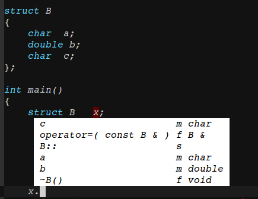
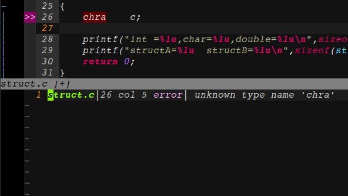

# Ubuntu 系统环境设置问题

- [Ubuntu 系统环境设置问题](#ubuntu-系统环境设置问题)
  - [安装python依赖库](#安装python依赖库)
  - [安装chrome浏览器](#安装chrome浏览器)
  - [pip和pip3安装报错](#pip和pip3安装报错)
  - [ubuntu 16下安装spyder3](#ubuntu-16下安装spyder3)
  - [安装搜狗输入法](#安装搜狗输入法)
  - [WPS无法输入中文](#wps无法输入中文)
  - [安装赛睿霜冻之蓝v2驱动](#安装赛睿霜冻之蓝v2驱动)
  - [zsh oh-my-zsh默认shell的最佳替代品](#zsh-oh-my-zsh默认shell的最佳替代品)
    - [安装zsh](#安装zsh)
    - [安装vimrc](#安装vimrc)
    - [安装oh-my-zsh](#安装oh-my-zsh)
    - [安装zsh-syntax-highlighting](#安装zsh-syntax-highlighting)
  - [vim配置](#vim配置)
    - [YouCompleteMe实现vim自动补全](#youcompleteme实现vim自动补全)


---
## 安装python依赖库
`注意：Python2 的话用pip安装，Python3用pip3安装（总之要知道安装在哪里，有的系统将python软连接到Python3上了）`
```shell
pip install scipy numpy scikit-image scikit-learn jupyter notebook matplotlib pandas
```
**DGX-ONE**服务器下安装：
```shell
apt-get install scipy
apt-get install numpy
apt-get install python-skimage(install skimage)
(pspnet): install matio
```

---
## 安装chrome浏览器
***[参考地址](https://blog.csdn.net/qq_30164225/article/details/54632634)***

将下载源加入系统源列表:    
```shell
sudo wget http://www.linuxidc.com/files/repo/google-chrome.list -P /etc/apt/sources.list.d/
```
导入谷歌软件公钥:   
```shell
wget -q -O - https://dl.google.com/linux/linux_signing_key.pub | sudo apt-key add -
```
更新源:   
```shell
sudo apt-get update
```
安装chrome
```shell
sudo apt-get install google-chrome-stable
```

---
## pip和pip3安装报错
**问题描述**
```shell
$ pip3 --version
Traceback (most recent call last):
  File "/usr/bin/pip3", line 5, in <module>
    from pkg_resources import load_entry_point
  File "/usr/lib/python3/dist-packages/pkg_resources.py", line 2708, in <module>
    working_set.require(__requires__)
  File "/usr/lib/python3/dist-packages/pkg_resources.py", line 686, in require
    needed = self.resolve(parse_requirements(requirements))
  File "/usr/lib/python3/dist-packages/pkg_resources.py", line 584, in resolve
    raise DistributionNotFound(req)
pkg_resources.DistributionNotFound: pip==1.5.6
```
**解决方法**
```shell
sudo python3 get-pip.py
sudo python3 ez_setup.py
```
其中[get-pip.py](./source/fix_pip/get-pip.py)和[ez_setup.py](./source/fix_pip/ez_setup-pip.py)文件在`source/fix_pip/`文件夹中。

---
## ubuntu 16下安装spyder3
安装pip3：
```shell
sudo apt install python3-pip
```
安装 Spyder 最新版本，目前即为 Spyder 3：
```shell
pip3 install -U spyder
```
命令行下运行即可：
```shell
spyder3
```
若运行时发现报错：`qtpy.PythonQtError: No Qt bindings could be found`
那就安装 pyqt5（目前最新为5）……：$ 
```shell
pip3 install -U pyqt5
```

---
## 安装搜狗输入法

1. [下载linux版搜狗输入法](https://pinyin.sogou.com/linux/?r=pinyin)    
2. 命令行运行：    
   ```shell
    sudo dpkg -i sogoupinyin_2.2.0.0108_amd64.deb
   ```
3. System Setting -> Language Support -> Keyboard input method system:`fcitx`    
4. 状态栏->输入法->打开Fcitx配置窗口，点击`+`去掉`Only Show Current Language`前面对号，然后搜`sogou`添加好，重启电脑即可。    
5. 有可能重启后会出现两个输入法图标，解决方法：    
   ```shell
   sudo apt-get remove fcitx-ui-qimpanel
   ```
---
## WPS无法输入中文    
**问题**：Ubuntu16.04自带的libre对于office的格式兼容性太差，只好安装了WPS。但是WPS文字、表格、演示均不能输入中文。   
**原因**：环境变量未正确设置。 
**解决办法**:    
#### WPS文字
打开终端输入：
```shell
sudo vim /usr/bin/wps
```    
添加一下文字到打开的文本中（添加到“#!/bin/bash”下面）：   
```shell
export XMODIFIERS="@im=fcitx"
export QT_IM_MODULE="fcitx"    
```    
#### WPS表格
打开终端输入：
```shell
sudo vim /usr/bin/et
```    
添加一下文字到打开的文本中（添加到“#!/bin/bash”下面）：
```shell
export XMODIFIERS="@im=fcitx"
export QT_IM_MODULE="fcitx"
```
####  WPS演示
打开终端输入：
```shell
sudo vim /usr/bin/wpp
``` 
添加一下文字到打开的文本中（添加到“#!/bin/bash”下面）：
```shell
export XMODIFIERS="@im=fcitx"
export QT_IM_MODULE="fcitx"
```
修改完后保存，打开相应的程序切换输入法就可以输入中文了。

---
## 安装赛睿霜冻之蓝v2驱动
先安装依赖项：   
```shell
sudo apt-get install build-essential python-dev libusb-1.0-0-dev libudev-dev
```
接着安装驱动：   
```shell
sudo pip install rivalcfg
```

---
## zsh oh-my-zsh默认shell的最佳替代品
### 项目地址   
- **[zsh](http://www.zsh.org)**     
- **[vimrc](https://github.com/amix/vimrc)**
- **[oh-my-zsh](http://ohmyz.sh)**      
- **[zsh-syntax-highlighting](https://github.com/zsh-users/zsh-syntax-highlighting)**    

### 安装zsh   
```shell   
sudo apt-get install zsh
```
#### 设置zsh为系统默认shell   
**为root用户修改默认shell为zsh**   
```shell
chsh -s /bin/zsh root
```
**为当前用户修改默认shell为zsh**   
```shell
chsh -s /bin/zsh
# or
chsh -s `which zsh`
```
**恢复命令**   
```shell
chsh -s /bin/bash
```


### 安装vimrc    
**Install for your own user only**    
The awesome version includes a lot of great plugins, configurations and color schemes that make Vim a lot better. To install it simply do following from your terminal:
```shell
git clone --depth=1 https://github.com/amix/vimrc.git ~/.vim_runtime 

sh ~/.vim_runtime/install_awesome_vimrc.sh
```
**Install for multiple users**    
To install for multiple users, the repository needs to be cloned to a location accessible for all the intended users.    
```shell
git clone --depth=1 https://github.com/amix/vimrc.git /opt/vim_runtime
sh ~/.vim_runtime/install_awesome_parameterized.sh /opt/vim_runtime user0 user1 user2
# to install for all users with home directories
sh ~/.vim_runtime/install_awesome_parameterized.sh /opt/vim_runtime --all
```
Naturally, /opt/vim_runtime can be any directory, as long as all the users specified have read access.   

**错误处理**    
在运行vim的时候提示如下错误：    
```vim
vim-go requires Vim 7.4.2009 or Neovim 0.3.1, but you're using an older version.
Please update your Vim for the best vim-go experience.
If you really want to continue you can set this to make the error go away:
    let g:go_version_warning = 0
Note that some features may error out or behave incorrectly.
Please do not report bugs unless you're using Vim 7.4.2009 or newer or Neovim 0.3.1.
```
***解决方法***：    
编辑`.vimrc`    
```shell
vim ~/.vimrc
```
添加一行    
```vim
let g:go_version_warning = 0
```
保存退出 问题解决   
        
    
    
### 安装oh-my-zsh   
**via curl**   
```shell
sh -c "$(curl -fsSL https://raw.githubusercontent.com/robbyrussell/oh-my-zsh/master/tools/install.sh)"
```
**via wget**   
```shell
sh -c "$(wget https://raw.githubusercontent.com/robbyrussell/oh-my-zsh/master/tools/install.sh -O -)"
```   
   

**add to ~/.zshrc**   
```shell
export PATH=$PATH:/usr/local/go/bin
#export PATH=$PATH:/Applications/MAMP/bin/php/php5.6.10/bin:/Users/GZM/composer:/Users/GZM/.composer/vendor/bin
#export GOPATH=/Users/GZM/work/go
#export GOPATH=/Volumes/Transcend/git/360/private_cloud_server_code/tools/gowork/
#export GOBIN=$GOPATH/bin
#export GO15VENDOREXPERIMENT=1
LC_CTYPE=en_US.UTF-8
LC_ALL=en_US.UTF-8
```
**插件**   

[Plugins](https://github.com/robbyrussell/oh-my-zsh/wiki/Plugins)   

**升级**   
```shell
upgrade_oh_my_zsh
```

**使用oh-my-zsh后导致的卡顿问题**    
现象是每次cd和ll时都会被卡住很长时间根本受不了，最后在官方github查明原因是使用的主题会自动获取git信息，可以使用以下命令禁止zsh自动获取git信息，解决卡顿问题:    
```shell
git config --global oh-my-zsh.hide-status 1
```
若想恢复则：    
```shell
git config --global oh-my-zsh.hide-status 0
```


### 安装zsh-syntax-highlighting    
**Oh-my-zsh**    
1. Clone this repository in **oh-my-zsh**'s plugins directory:
  ```shell
    git clone https://github.com/zsh-users/zsh-syntax-highlighting.git ${ZSH_CUSTOM:-~/.oh-my-zsh/custom}/plugins/zsh-syntax-highlighting
  ```
2. Activate the plugin in `~/.zshrc`:    
  ```shell
    plugins=(
      git
      zsh-syntax-highlighting
    )
  ```
3. Source `~/.zshrc` to take changes into account:   
  ```shell
    source ~/.zshrc
  ```

**In your ~/.zshrc**    

1. Simply clone this repository and source the script:
```shell
git clone https://github.com/zsh-users/zsh-syntax-highlighting.git
echo "source ${(q-)PWD}/zsh-syntax-highlighting/zsh-syntax-highlighting.zsh" >> ${ZDOTDIR:-$HOME}/.zshrc
```
2. Then, enable syntax highlighting in the current interactive shell:    
```shell
source ./zsh-syntax-highlighting/zsh-syntax-highlighting.zsh
```
If git is not installed, download and extract a snapshot of the latest development tree from:   
```shell
https://github.com/zsh-users/zsh-syntax-highlighting/archive/master.tar.gz
```
Note the `source` command must be **at the end** of `~/.zshrc`.


---
## vim配置
### YouCompleteMe实现vim自动补全    

1 准备条件 

(1) 最新版的`Vim(7.3.584+)`，须支持`python`。    
终端输入命令：`vim –version` 或 打开vim用命令：version 查看版本信息，若python前有‘+’即可。    
然后终端执行命令，安装相关依赖项：   
```shell
sudo apt-get install python-dev
```
装的过程中若遇到问题，依次执行以下命令：    
```shell
sudo apt-get update
sudo apt-get install -f
```
之后重试安装：    
```shell
sudo apt-get install python-dev
```

(2) 安装`cmake`    
```shell
sudo apt-get install cmake
```

(3) 安装`clang`   
```
sudo apt-get install clang
```
**或者跳过这步**，后面编译**YCM**(YouCompleteMe)时，如果没有clang会自动安装。 

(4)安装`Vundle`   
这个是用来管理`vim`插件的，安装和卸载都特别方便，各个插件是一个文件夹，放在目录`bunble`下。 


2 安装**vundle**   
(1) 下载`vundle`源码到本地    
```shell
git clone https://github.com/gmarik/vundle.git ~/.vim/bundle/vundle
```

(2) 在 `.vimrc` 的文件起始处，插入以下内容并保存：   
```vim
set nocompatible  " be iMproved

set rtp+=~/.vim/bundle/vundle/
call vundle#rc()

" let Vundle manage Vundle
" required!
Bundle 'scrooloose/syntastic'
Bundle 'gmarik/vundle'

" My bundles here:
"
" original repos on GitHub
Bundle 'tpope/vim-fugitive'
Bundle 'Lokaltog/vim-easymotion'
Bundle 'rstacruz/sparkup', {'rtp': 'vim/'}
Bundle 'tpope/vim-rails.git'
" vim-scripts repos
Bundle 'L9'
Bundle 'FuzzyFinder'
" non-GitHub repos
Bundle 'git://git.wincent.com/command-t.git'
" Git repos on your local machine (i.e. when working on your own plugin)
Bundle 'file:///Users/gmarik/path/to/plugin'
" ...
Bundle 'Valloric/YouCompleteMe'
filetype plugin indent on     " required!
```
**注意**：`Bundle ‘插件名或git链接’ `表示要安装的插件     

(3)再次打开vim，在命令行模式中执行：
```vim
BundleInstall
```
   
进入安装插件过程：    
   

Plugin前面有`‘>’`表示该插件正在安装，YoucompleteMe插件安装的时间比较长，耐心等待，不要退出，最后会提示有一个错误，这是正常的，因为ycm需要手工编译出库文件，就像上图中的‘！’，忽略它。    
**注**：若要卸载插件，只需将`.vimrc`中 “Bundle ‘插件’ ”这条语句删掉，然后在vim 命令行模式中执行：`BundleClean`即可。    

3  编译YouCompleteMe     

(1) 进入YouCompleteMe文件夹下    
```shell
cd  ~/.vim/bundle/YouCompleteMe/
```
   

(2) 编译
```shell
./install.sh  --clang-completer
```
参数`–clang-completer`是为了支持C/C++的补全，不需要可以不加。编译过程比较长，耐心等待。    


4  修改.vimrc配置文件
(1) 找到配置文件`.ycm_extra_conf.py`在~/.vim/bundle/YouCompleteMe/third_party/ycmd/下面:    
```shell
cd ~/.vim/bundle/YouCompleteMe/thrid_party/ycmd/
```
`ls -a` 即可看到。    

(2) 自行在`YoucompleteMe/`中创建`cpp/ycm`目录，将 `.ycm_extra_conf.py`拷贝进去:    
```shell
cd ~/.vim/bundle/YouCompleteMe
mkdir cpp
mkdir cpp/ycm
cp ~/.vim/bundle/YouCompleteMe/thrid_party/ycmd/.ycm_extra_conf.py ~/.vim/bundle/YouCompleteMe/cpp/ycm/
```

(3) 修改`.vimrc`配置文件
将下面的内容添加到`.vimrc`里面:    
```vim
" 寻找全局配置文件
let g:ycm_global_ycm_extra_conf = '~/.vim/bundle/YouCompleteMe/cpp/ycm/.ycm_extra_conf.py'
" 禁用syntastic来对python检查
let g:syntastic_ignore_files=[".*\.py$"] 
" 使用ctags生成的tags文件
let g:ycm_collect_identifiers_from_tag_files = 1
" 开启语义补全
" 修改对C语言的补全快捷键，默认是CTRL+space，修改为ALT+;未测出效果
"let g:ycm_key_invoke_completion = '<M-;>'
" 设置转到定义处的快捷键为ALT+G，未测出效果
"nmap <M-g> :YcmCompleter GoToDefinitionElseDeclaration <C-R>=expand("<cword>")<CR><CR> 
"关键字补全
"let g:ycm_seed_identifiers_with_syntax = 1
" 在接受补全后不分裂出一个窗口显示接受的项
set completeopt-=preview
" 让补全行为与一般的IDE一致
set completeopt=longest,menu
" 不显示开启vim时检查ycm_extra_conf文件的信息
let g:ycm_confirm_extra_conf=0
" 每次重新生成匹配项，禁止缓存匹配项
let g:ycm_cache_omnifunc=0
" 在注释中也可以补全
let g:ycm_complete_in_comments=1
" 输入第一个字符就开始补全
let g:ycm_min_num_of_chars_for_completion=1
" 错误标识符
let g:ycm_error_symbol='>>'
" 警告标识符
let g:ycm_warning_symbol='>*'
" 不查询ultisnips提供的代码模板补全，如果需要，设置成1即可
" let g:ycm_use_ultisnips_completer=0
```
上面的内容中，除了第一句寻找全局配置文件，其他的语句可以根据自己的需要更改、删除或添加。 
**注**：如果没有在第(3)步中自己创建`cpp/ycm`目录拷贝`.ycm_extra_conf.py`文件，则需要将第一句中的路径改为全局配置文件所在的具体路径，如下：   
```vim
let g:ycm_global_ycm_extra_conf = '~/.vim/bundle/YouCompleteMe/thrid_party/ycmd/.ycm_extra_conf.py'
```

5 保存退出`.vimrc` ,打开一个C/C++源程序，体验其自动补全效果。    
   

6 配合上面安装的`syntastic`还可以语法检测     
   

`‘>>’`指出有语法错误，但是检测速度太慢，没什么大用。自我感觉这个语法自动检测很烦，可以禁用它：    
进入 `/bundle/YouCompleteMe/plugin`，修改`youcompleteme.vim`中的：    
   
将如上图中的`第141行`的参数改为`0`就可以了。    

7 `YcmDiags`插件可以显示错误或警告信息，可以设置`F9`为打开窗口的快捷键，在`.vimrc`中添加语句：   
   
显示效果：   
   

8 添加头文件     
目前在`include`中，无法补全`stdio.h`等头文件，我们需要将`/usr/include`添加进去。路径添加到 `~/.vim/bundle/YouCompleteMe/cpp/ycm/.ycm_extra_conf.py` 或者`~/.vim/bundle/YouCompleteMe/thrid_party/ycmd/.ycm_extra_conf.py`文件中的`flags` 数组中，每增加一个路径，前面要写`’-isystem’`。     
   
以后需要boost库等其他的补全，也需要将相应的路径添加进去。