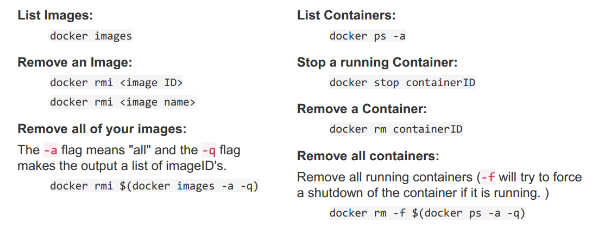
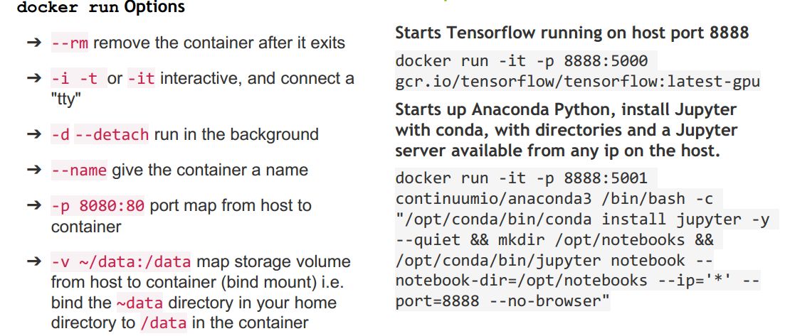

# 深度学习服务器FAQ
- [docker常用命令](#docker常用命令)
- [多显卡训练问题](#多显卡问题)
- [远程访问服务器Jupyter Notebook](#远程访问服务器jupyter-notebook)
  - [方法1 ssh远程使用jupyter notebook](#方法1-ssh远程使用jupyter-notebook)
  - [方法2 利用jupyter notebook自带的远程访问功能](#方法2-利用jupyter-notebook自带的远程访问功能)


---
## docker常用命令
    
```shell
docker ps       ##查看正在运行的容器
docker ps –a    ##查看所有容器
```
    
```shell
$ docker run --runtime=nvidia -e NVIDIA_VISIBLE_DEVICES=0,1 --restart=always --net=host -v /home/inspur/data/:/data -it -d --name caffe-test-2gpu caffe-py2 bash
--runtime=nvidia    ##使用nvidia docker
-e NVIDIA_VISIBLE_DEVICES=0,1   ##指定该容器使用的GPU ID，不加该参数默认为all
--restart=always    ##使容器一直运行，除非手动stop
--net=host          ##使容器桥接主机的网络
-v /home/inspur/data/:/data	##挂载本地目录，/home/inspur/data/为物理机绝对路径，/data为容器内目录(进docker为root权限，所以/data挂在为根目录下)
-it                 ##交互
-d                  ##后台运行
--name caffe-test   ##给该容器命名
caffe-py2           ##基于该镜像
bash                ##容器运行之后启动的命令
```

```shell
$ docker attach caffe-test-2gpu	##进入容器进行操作
```
根据container ID，可以启动、停止、返回、删除容器，分别对应为start/stop/attach/rm命令   

```shell
1 镜像相关
- 搜索可用镜像
# docker search imagesName          
- 删除镜像
# docker rmi [-f] imageID/imagesName
-f 为强制删除
- 拉取镜像
# docker pull imagesName:tag
- 保存镜像到本地
保存单个镜像
# docker save imagesName／imageID > /path/image.tar     
保存多个镜像
# docker save imagesName1／imageID1 imagesName2／imageID2 [imagesNameN／imageIDn] > /path/to/image_Name.tar     
当需要把一台计算机上的镜像迁移到另一台计算机上时，需要保存镜像到本地。然后使用winscp将image.tar从机器a拷到机器b上，最后加载镜像。
- 加载本地镜像
# docker  load  -i /path/image.tar   
或
# docker  load  <  /path/image.tar
- 推送镜像到镜像仓库registry
# docker push imagesName:tag/imageID                
- 从镜像运行一个容器，并在容器中运行一条命令
# docker run -d imagesName:tag  [cmd]              
- 从镜像运行一个容器，并在容器中运行交互式命令
# docker run -it imagesName:tag  [cmd]          
- 构建镜像
我们可以为每一个项目建立一个文件夹，在每个文件夹下放置1个dockerfile，并使用下面命令，手动构建镜像。
// Dockerfile在当前目录下                                        
# docker build -t imagesName .    
我们也可以使用下面命令构建镜像，或者结合docker-compose-file.yml，使用build选项自动构建镜像。
// Dockerfile在其他目录下, 绝对路径后不带Dockerfile名称
# docker build -t imageName /path/to/Dockerfile  

2 容器相关
- 查看容器
// 查看正在运行的容器
# docker  ps                    
// 列出最近一个运行过的容器
# docker  ps  -l                
// 查看所有容器，包括已经停止的
# docker  ps  -a                
// 只展示正在运行的容器ID
# docker  ps  -q                
- 删除容器
// 删除停止的容器1和容器2
# docker rm -f containerID1/names containerID2/names    
// 删除所有容器 
# docker rm $(docker ps -a -q)    
// 批量删除已经处于停止状态（exit）的容器
# docker rm -f `docker ps -a |awk '{print $1}' | grep [0-9a-z]`    
- 停止/启动/重启/杀死一个容器
// 发送一个信号，等待容器的停止
# docker stop containerID/names
// 启动停止的容器                                  
# docker start [-i] containerID/names      
// 重启运行中的容器                                   
# docker restart containerID/names   
// 杀死一个容器                                      
# docker kill containerID/names                                        
- 查看容器日志
# docker logs [-f] [-t] [--tail 数字] containerID/names   
没加参数，表示查看全部日志；-f –follows=true 默认为false，表示一直更新，ctrl+c退出；-t –timestamps=true | false 加上时间戳 ; –tail 数字，指定查看最新数目的日志)
- 将容器重新提交为一个镜像
# docker commit containerID imagesName            
- 运行容器
a. 运行一次性容器
# docker run imagesName  [含绝对路径的command]  [arg]         
容器启动一次，运行一个命令，最后停止
b. 运行交互式容器
# docker run -it imagesName [含绝对路径command]                        
执行容器中的命令, 就像在使用虚拟机一样，最后ctrl+p ctrl+q，使容器在后台运行（-i –interactive=true|false，默认是false；-t –tty=true|false，默认是false）
c. 运行自定义容器
# docker run -it --name=自定义容器名 imagesName [含绝对路径的command] 
d. 运行守护式容器
# docker run  -d  imageName [含绝对路径的command]      
-d，等效于ctrl+p ctrl+q ，能够长期运行。没有交互式会话，适合运行应用程序和服务
–restart=always，自动重新启动容器
–restart=on-failure:5，指定重启次数
f. 运行守护式进程
# docker run -d --name=自定义容器名 imageName [含绝对路径command]      
在后台运行守护式进程命令，执行完命令，容器依然会退出
- 附加到已经存在的容器的命令行
# docker attach containerID/names
有些镜像附着会失败，使用ctrl+c退出
- 查看容器详情，返回配置信息
# docker inspect  containerID/names                              
- 查看运行容器中的进程
# docker top  containerID/names                               
- 在容器运行后，进入容器的命令行
# docker exec -it containerID/names   [command]   [ARG]    
虽然docker的哲学是一个容器运行一个进程，但是要维护容器的话，就要新启动一个进程。启动参数如下：
-I，--interactive=true|false，默认是false，启动交互式容器
-t，--tty=true|false，默认是false
--privileged，使用该参数container内的root拥有真正的root权限。若没有此参数，container内的root只是外部的一个普通用户权限。privileged启动的容器，可以看到很多host上的设备，并且可以执行mount，甚至允许你在docker容器中启动docker容器
- 从一个容器连接到另一个容器
# docker  run  -it  --name sonar tpires/sonar-server --link mysql:db
将sonar容器连接到mysql容器，并将mysql容器重命名为db。这样，sonar就可以使用db相关的环境变量了。
- 挂载数据卷
# docker  run  -it  -v  /root/software/:/mnt/software/  -v  /opt/dir/:/mnt/soft/  25c5298b1a36   /bin/bash
-v：表示需要将本地哪个目录挂载到容器中，格式：-v <宿主机目录>:<容器目录>
- 运行容器中的脚本
# docker run -d -p 808:80 --name javaweb  locutus1/javaweb:0.1     /root/run.sh
以下为脚本的内容
// 注意：这里必须先加载环境变量，然后使用Tomcat的运行脚本来启动Tomcat服务
# vim /root/run.sh
!/bin/bash
source  ~/.bashrc
sh /opt/tomcat/bin/catalina.sh   run 
# chmod u+x /root/run.sh              // 为运行脚本添加执行权限

3 守护进程相关
- 开启、停止、重启docker守护进程
# service start/stop/restart docker     
- 显示Docker运行环境信息
# docker info        
- 查看docker守护进程状态
# ps -ef | grep docker        
```

---
## 多显卡训练问题
若进docker时没有指定显卡，则docker默认用所有的显卡，容器中的显卡序列号与外部保持一致；   
若进docker时指定了显卡(如-e NVIDIA_VISIBLE_DEVICES=2,3)，则docker容器中显卡的序列号从0开始编号(0,1)。   


---
## 远程访问服务器Jupyter Notebook    
### 方法1 ssh远程使用jupyter notebook    

- 在**远程服务器**上，启动`jupyter notebook`服务：    
    ```shell
    jupyter notebook --allow-root --port=8889
    ```

- 在**本地终端**中启动`SSH`：    
    ````shell
    ssh -N -f -L localhost:8890:localhost:8889 username@serverIP
    ````
    - `-N` 告诉`SSH`没有命令要被远程执行
    - `-f` 告诉`SSH`在后台执行
    - `-L` 是指定port forwarding的配置，远端端口是`8889`，本地的端口号的`8890`    

    **注意**：username@serverIP替换成服务器的对应账号。

- 最后在**本地**打开浏览器，访问：http://localhost:8890/


### 方法2 利用jupyter notebook自带的远程访问功能
官方指南：[官方指南](https://jupyter-notebook.readthedocs.io/en/latest/public_server.html#notebook-server-security)

- **生成默认配置文件**    
    默认情况下，配置文件`~/.jupyter/jupyter_notebook_config.py`并不存在，需要自行创建。使用下列命令生成配置文件:    
    ```shell
    jupyter notebook --generate-config
    ```
    如果是`root`用户执行上面的命令，会发生一个问题：
    ```shell
    Running as root it not recommended. Use --allow-root to bypass.
    ```
    提示信息很明显，`root`用户执行时需要加上`--allow-root`选项。
    ```shell
    jupyter notebook --generate-config --allow-config
    ```
    执行成功后，会出现下面的信息：
    ```shell
    Writing default config to: /root/.jupyter/jupyter_notebook_config.py
    ```
- **生成访问密码(token)**
    - **自动生成**    
        从`jupyter notebook 5.0`版本开始，提供了一个命令来设置密码：`jupyter notebook password`，生成的密码存储在： `jupyter_notebook_config.json`：    
        ```shell
        $ jupyter notebook password
        Enter password:  ****
        Verify password: ****
        [NotebookPasswordApp] Wrote hashed password to /Users/you/.jupyter/jupyter_notebook_config.json
        ```
    - **手动生成**    
        除了使用提供的命令，也可以通过手动安装，推荐使用的手动安装，因为`jupyter notebook password` 出来一堆内容，没耐心看。打开 `ipython` 执行下面内容：    
        ```python
        In [1]: from notebook.auth import passwd
        In [2]: passwd()
        Enter password:
        Verify password:
        Out[2]: 'sha1:67c9e60bb8b6:9ffede0825894254b2e042ea597d771089e11aed'
        ```
        `sha1:67c9e60bb8b6:9ffede0825894254b2e042ea597d771089e11aed` 这一串就是要在 `jupyter_notebook_config.py` 添加的密码。    
        ```python
        c.NotebookApp.password = u'sha1:67c9e60bb8b6:9ffede0825894254b2e042ea597d771089e11aed'
        ```

- **配置config文件**    
    在 `jupyter_notebook_config.py` 中找到下面的行，取消注释并修改:   
    ```python
    c.NotebookApp.ip='*'
    c.NotebookApp.password = u'sha:ce...刚才复制的那个密文'
    c.NotebookApp.open_browser = False
    c.NotebookApp.port =8888 #可自行指定一个端口, 访问时使用该端口
    ```

- **服务器**上启动 `jupyter notebook`:    
    ```shell
    jupyter notebook
    ```
    `root`用户使用:
    ```shell
    jupyter notebook --allow-root
    ```

- 最后**本地浏览器**打开`IP:指定的端口`，访问：http://ip:8888/，输入密码就可以访问了。需要注意的是不能在隐藏目录 (以 `.` 开头的目录)下启动 `jupyter notebook`, 否则无法正常访问文件。

**参考资料**    
> 1. [远程访问服务器Jupyter Notebook的方法](https://www.jianshu.com/p/8fc3cd032d3c)    
> 2. [Jupyer Notebook官方指南](https://jupyter-notebook.readthedocs.io/en/latest/public_server.html#notebook-server-security)
> 3. [设置 jupyter notebook 可远程访问](https://blog.csdn.net/simple_the_best/article/details/77005400)


---
