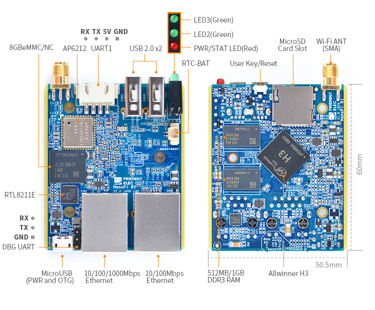
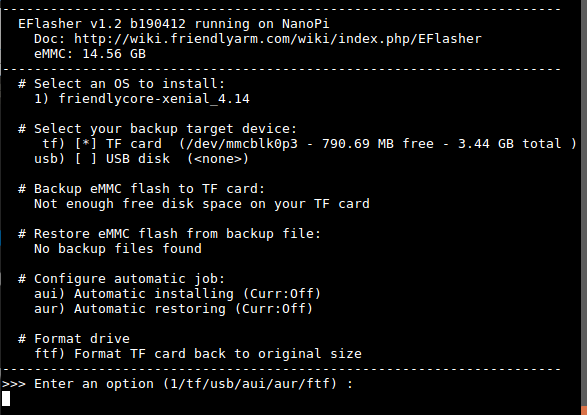
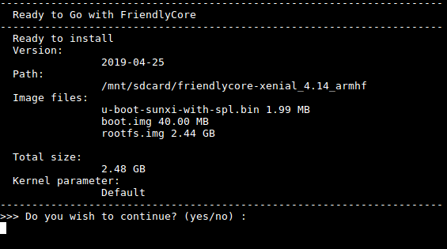
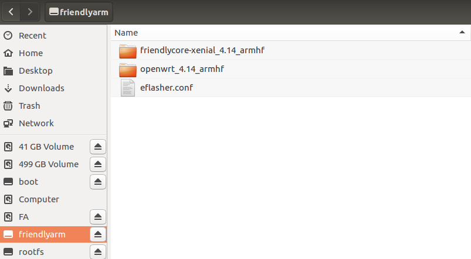
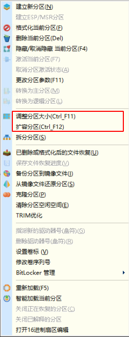
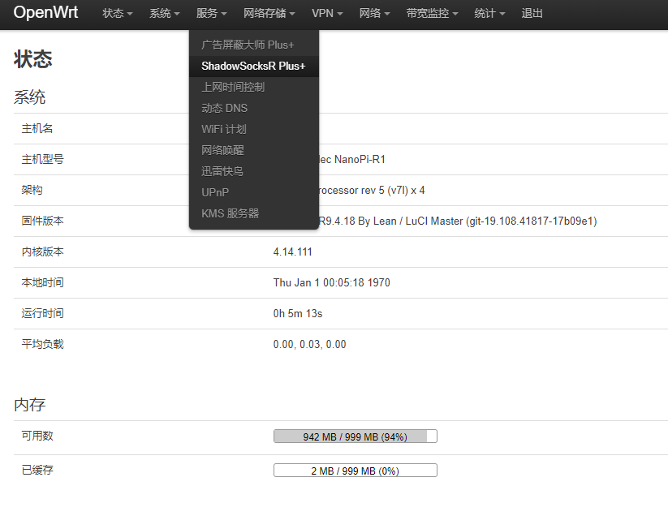

# NanoPi-R1烧写系统

*这里着重介绍烧写至eMMC方式*   

## 介绍
- NanoPi R1（以下简称R1）是友善之臂团队面向创客、嵌入式爱好者，电子艺术家、发烧友等群体推出的又一款完全开源的掌上创客神器。   
- NanoPi R1有**两个网口**，一个千兆网络，一个百兆网络，并支持2.4G Wi-Fi，友善之臂团队为NanoPi R1专门移植了OpenWRT系统，只需要简单的设置，就可打造一款完全属于你自己的路由器。    
- 有两个版本主要差别在:
  - DDR3 RAM: 512MB/1GB
  - Storage： NC/8GB eMMC

     

## 准备工作
- NanoPi R1主板
- 友善USB转TTL串口线USB2UART(eMMC版本刷系统需要)
- MicroSD卡/TF卡: Class10或以上的 8GB SDHC卡
- 一个MicroUSB接口的外接电源，要求输出为5V/2A（可使用同规格的手机充电器）
- 一台电脑，需要联网，建议使用Ubuntu 16.04 64位系统
- 下载[官方提供的系统](http://download.friendlyarm.com/nanopir1)

## 烧写Linux系统
### 烧写到TF卡
- FriendlyCore / Debian / Ubuntu / OpenWrt / DietPi 等系统本质上都属于 Linux 系统的发行版，所以它们的烧写方法是一样。
- 将 Linux 系统固件和烧写工具 win32diskimager.rar 分别解压，在 Windows 下插入TF卡（限4G及以上的卡)，以管理员身份运行烧写工具 win32diskimager，在烧写工具 win32diskimager 的界面上，选择你的TF卡盘符，选择Linux 系统固件，点击 Write 按钮烧写。
- 这里以nanopi-r1_sd_friendlycore-xenial_4.14_armhf_YYYYMMDD.img为例，其他系统的烧写操作是类似的，烧写时的界面如下：    
         

    成功烧写后，会看到如下界面：    
        
- 当制作完成TF卡后，拔出TF卡插入 BOOT 卡槽，上电启动（注意，这里需要5V/2A的供电），你可以看到STAT灯闪烁，这时你已经成功启动系统。    

### 烧写到eMMC
#### 烧写官方eflasher版本到eMMC
- 按照[烧写到TF卡](#烧写到TF卡)的方法先将`nanopi-r1_eflasher_friendlycore-xenial_4.14_armhf_YYYYMMDD.img`烧写到TF卡上；
- 用**友善USB转TTL串口线USB2UART**连接到NanoPi R1主板的debug串口, 在电脑**设备管理器**中查看USB设备警告设备，右键更新驱动以后可以在**端口(COM和LPT)**中看到已经连上的设备，注意需要使用5V/2A电源给开发板MicroUSB供电:
    

- 用`MobaXterm`或者`Putty`的串口链接上述对应的**COM端口**，晶振频率设为`115200`：
  
  
- 在命令行终端中通过执行下列命令进行烧写:
    ```shell
    su root # 密码fa
    eflasher
    ```
        
    输入“１”，选择烧写friendlycore系统到eMMC上后，会提示如下信息：       
        
    输入“yes”，确定进行烧写：    
        
- 等待烧写完毕后，断电并从BOOT卡槽中取出TF卡，此时再上电就会从 eMMC 启动系统了。


#### 烧写非eflasher(SD版本)到eMMC
这一块官方只有一句 *"如果想烧写其他系统映像到 eMMC ，请下载光盘里images-for-eflasher目录，将目录内的压缩包解压到 SD 卡的 FRIENDLYARM 分区。"*
   

这里介绍我烧写成功的[nanopi-h3_sd_lede_4.14_armhf_20190425.img](./linux/nanopi-r1/nanopi-h3_sd_lede_4.14_armhf_20190425.img.zip)版本:    
- 按照[烧写到TF卡](#烧写到TF卡)的方法先将`nanopi-r1_eflasher_friendlycore-xenial_4.14_armhf_YYYYMMDD.img`烧写到TF卡上，在这里的作用是引导将lede系统刷到emmc上；
- 用 **DiskGenius** 将**FriendlyArm**的`exFAT分区`扩充以放下更多的安装镜像:   
  
- 在Windows下的**磁盘管理**中给**FriendlyArm**分区分配一个磁盘编号。
- 将`nanopi-h3_sd_lede_4.14_armhf_20190425.img`文件放到**friendlyarm**文件夹下:
        
- 用**友善USB转TTL串口线USB2UART**连接到NanoPi R1主板的debug串口，在电脑**设备管理器**中查看USB设备警告设备，右键更新驱动以后可以在**端口(COM和LPT)**中看到已经连上的设备,注意需要使用5V/2A电源给开发板MicroUSB供电:
    

- 用`MobaXterm`或者`Putty`的串口链接上述对应的**COM端口**，晶振频率设为`115200`：
  
  

- 在命令行终端中通过执行下列命令进行烧写:
    ```shell
    su root # 密码fa
    ```
    到刚刚存放`nanopi-h3_sd_lede_4.14_armhf_20190425.img`目录下:   
    ```shell
    cd /mnt/sdcard
    ```
    查看所有磁盘情况，找到系统的eMMC磁盘：
    ```shell
    sudo fdick -l
    ```
    可以看到**eMMC**的盘符是`/dev/mmcblk1`
    用`dd`命令将`nanopi-h3_sd_lede_4.14_armhf_20190425.img`写到eMMC上:
    ```shell
    sudo dd if=nanopi-h3_sd_lede_4.14_armhf_20190425.img of=/dev/mmcblk1 bs=10MB
    ```
- 烧写完成后，拔下SD卡，重启即可
- 开启ssr服务：
  ```shell
  echo 0xDEADBEEF > /etc/config/google_fu_mode
  ```
- 进入路由器web页面，成功烧写：
    


## 资料
> [友善之臂官方文档](http://wiki.friendlyarm.com/wiki/index.php/NanoPi_R1/zh#.E4.BB.8B.E7.BB.8D)